# 🛰️ Aerial Image Processing Pipeline

> A from-scratch image processing pipeline built **without OpenCV, scipy, or any vision library** — every algorithm is implemented manually in pure Python + NumPy.

Tested on aerial imagery from the [AID (Aerial Image Dataset)](https://www.kaggle.com/datasets/jiayuanchengala/aid-scene-classification-datasets), collected from Google Earth.

---

## 📋 Table of Contents

- [Overview](#overview)
- [Pipeline Phases](#pipeline-phases)
- [Results](#results)
- [Installation & Usage](#installation--usage)
- [Implementation Notes](#implementation-notes)

---

## Overview

The pipeline takes one or more aerial images and runs them through seven sequential processing phases — from low-level channel manipulation all the way to object detection with bounding boxes. Everything from noise injection to Otsu thresholding to BFS-based connected component labelling is written from scratch.

**Tested scenes:**

| Bridge | Center | Church |
|:------:|:------:|:------:|
| 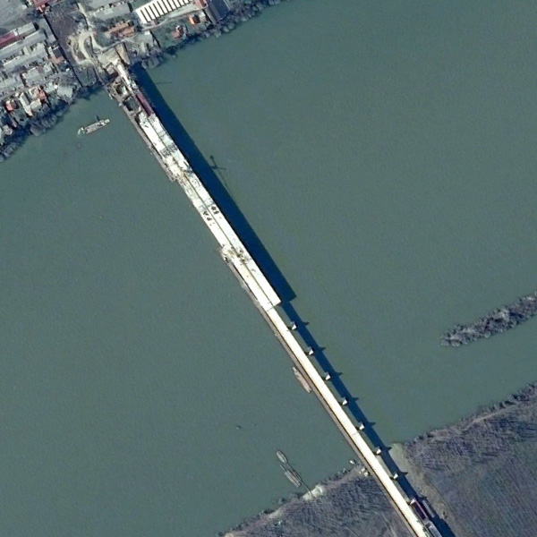 | 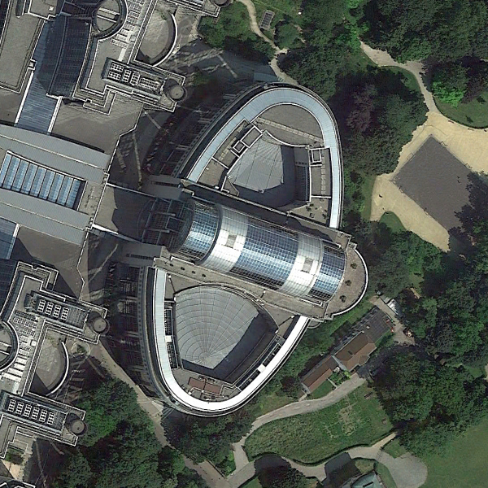 | 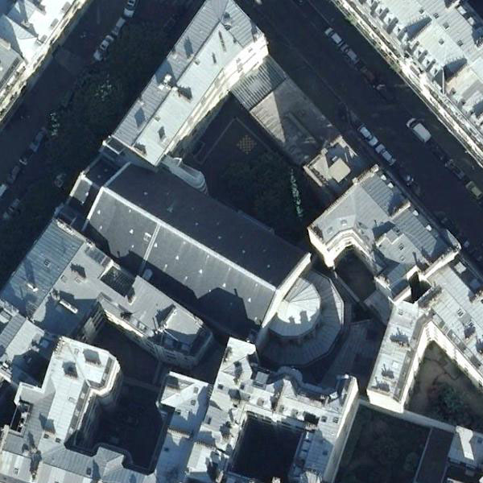 |
| River crossing, low texture | Complex building cluster | Dense urban rooftops |

---

## Pipeline Phases

### Phase A — RGB Channel Splitting

Each input image is decomposed into its **Red, Green, and Blue channels**, saved as individual greyscale PNGs. This step exposes per-channel spectral distribution before any processing.

| Bridge | Center | Church |
|--------|--------|--------|
| 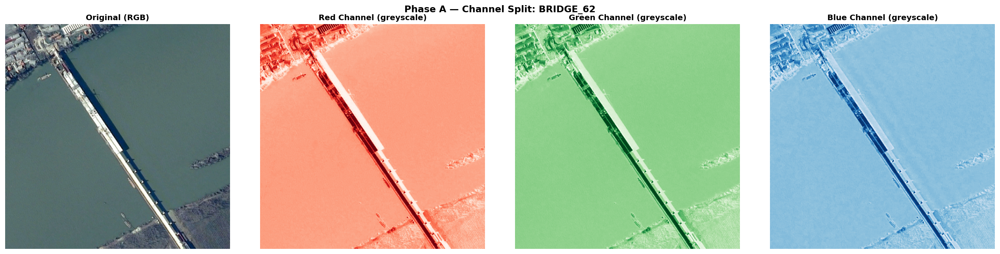 | 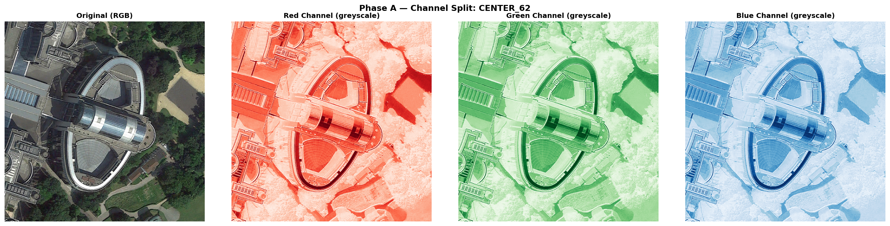 | 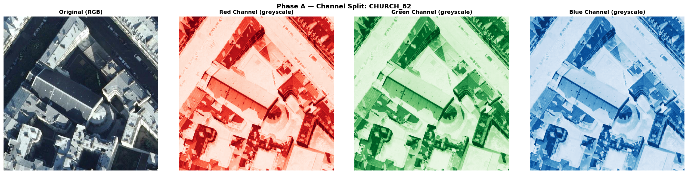 |

---

### Phase B — Red Channel Histogram

A histogram of the red channel's **DN (Digital Number) values** is generated, with mean and median marked. This reveals the luminance distribution and tonal range of each scene class.

---

### Phase C — Salt & Pepper Noise Injection

Salt-and-pepper noise is injected **manually** using a seeded random float map (no noise library). Half the noise ratio becomes black pixels (pepper), the other half becomes white (salt). At ratio `0.50`, half of all pixels are corrupted.

| Bridge | Center | Church |
|--------|--------|--------|
| 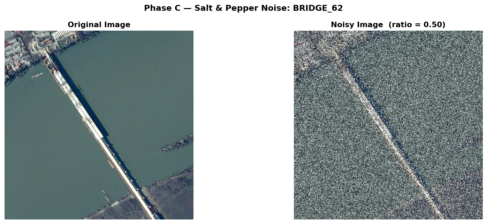 | 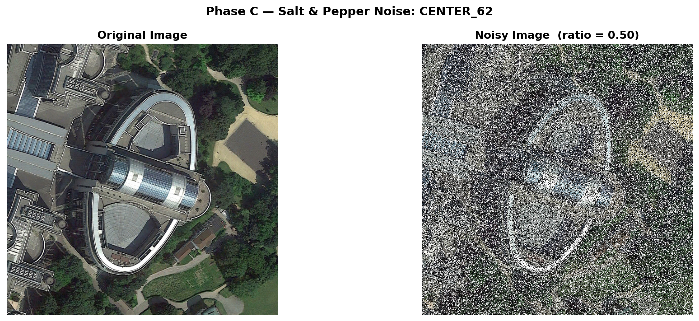 | 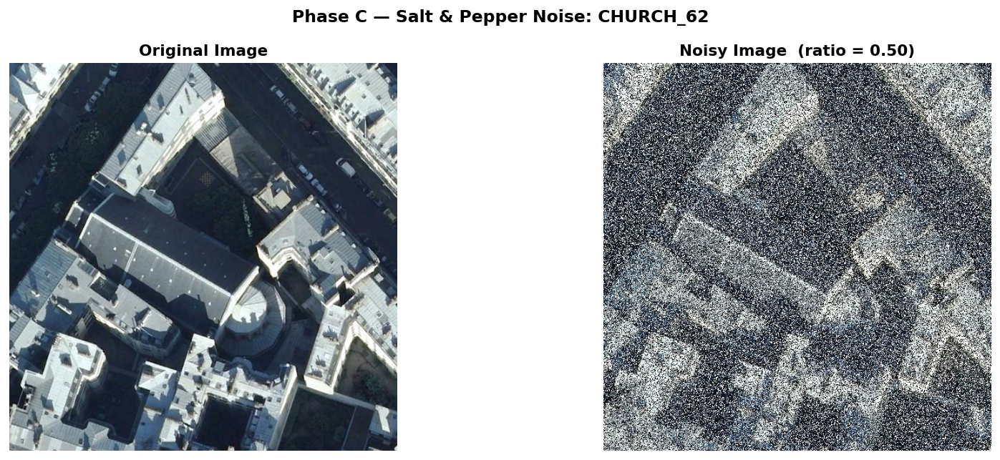 |

---

### Phase D — Manual Pixel Audit

A 5×5 window is extracted around a user-specified pixel. DN values are displayed in a matrix, sorted manually, and the median is hand-calculated — verifying the filter logic before it runs at scale.

---

### Phase E — Manual 3×3 Median Filter

A **3×3 median filter** is applied per channel using only Python's built-in `list.sort()` on each neighbourhood — no cv2, scipy, or skimage. Filter quality is measured with **MSE** and **PSNR**, both computed from scratch.

| Bridge | Center | Church |
|--------|--------|--------|
| 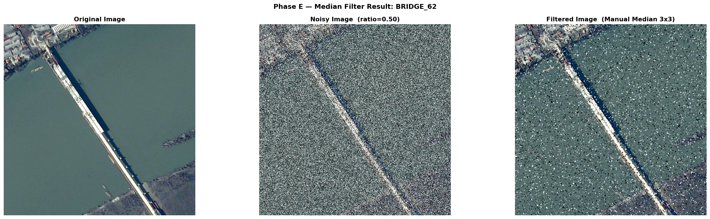 | 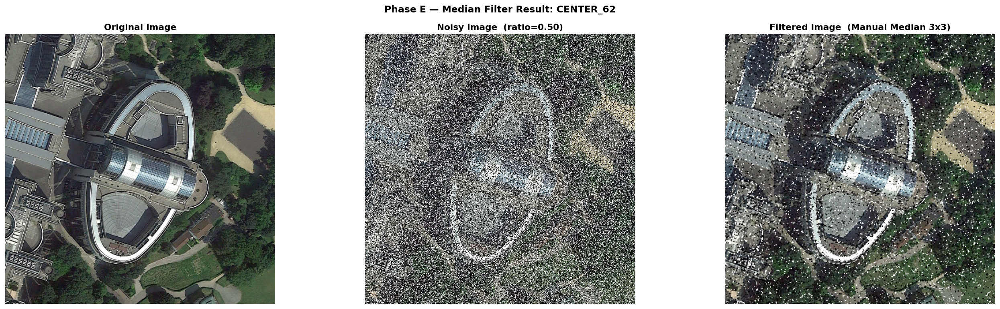 | 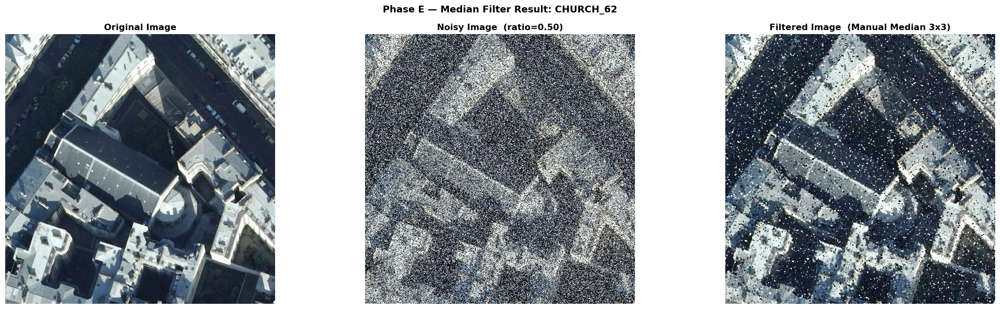 |

> Even at 50% noise, the filter recovers most structural features — the bridge deck and building outlines remain recognisable.

---

### Phase F — Texture Sensitivity Analysis

Mean gradient magnitude and pixel standard deviation are computed for each scene, **before and after filtering**, and compared across scene classes. This quantifies how much structural detail is lost during denoising.

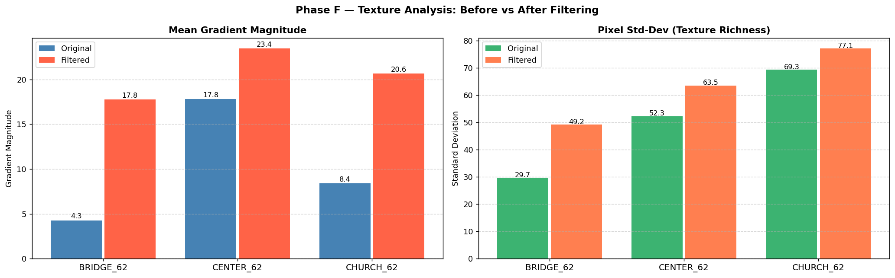

**Key finding:** The bridge scene has the lowest original gradient (4.3), reflecting large uniform water regions. The center and church scenes retain more edge energy due to their denser structural content. After filtering, all three scenes show increased apparent gradient — a known artefact of residual noise creating artificial high-frequency variation.

---

### Phase G — Object Detection

Object detection runs fully from scratch:

1. **Greyscale conversion** — weighted RGB (0.299 R + 0.587 G + 0.114 B)
2. **Manual Otsu thresholding** — iterates all 256 levels to maximise inter-class variance
3. **Morphological opening** — manual erosion then dilation to suppress isolated noise pixels
4. **BFS connected-component labelling** — flood-fill with a pure-Python stack queue
5. **Bounding boxes** — top 5 regions by pixel area, drawn with colour-coded rectangles

**Full pipeline comparison (original → noisy → filtered → detected):**

| Bridge | Center | Church |
|--------|--------|--------|
| 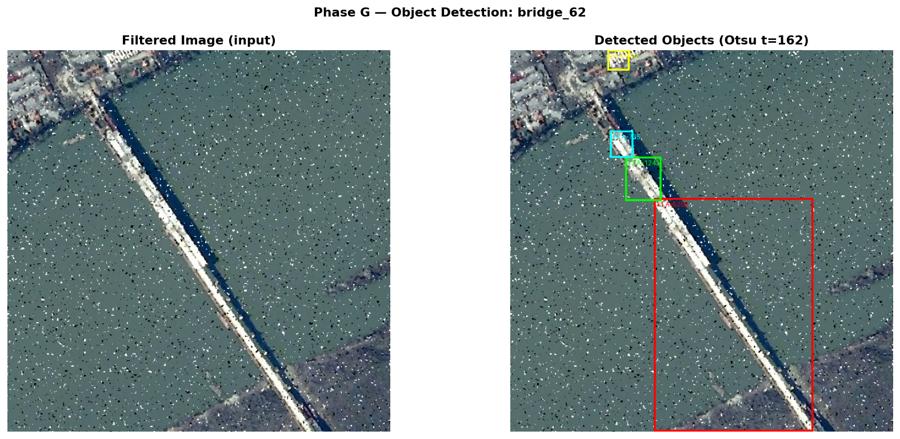 | 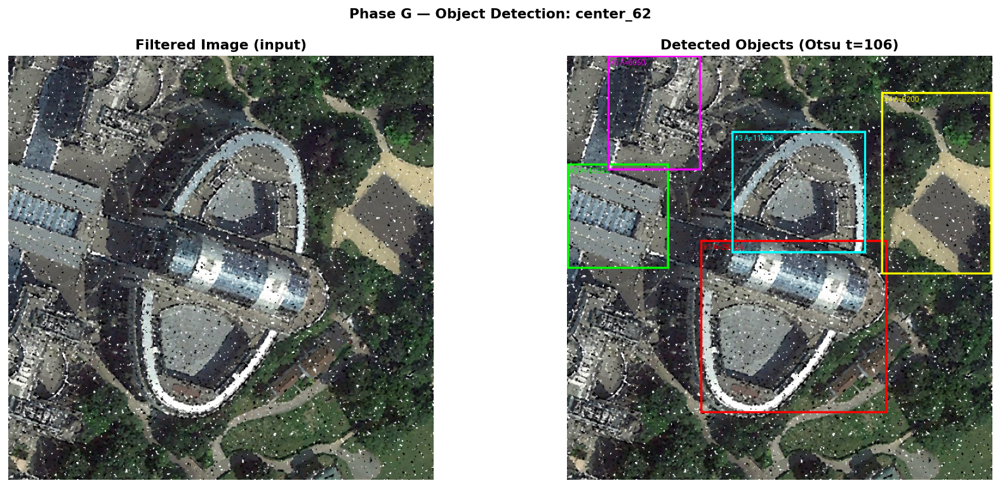 | 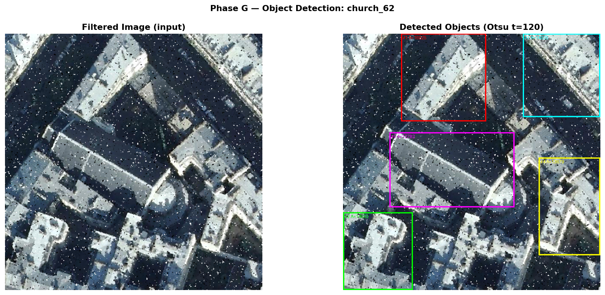 |

**Detection close-ups:**

| Bridge (Otsu = 166) | Center (Otsu = 113) | Church (Otsu = 123) |
|:-------------------:|:-------------------:|:-------------------:|
| 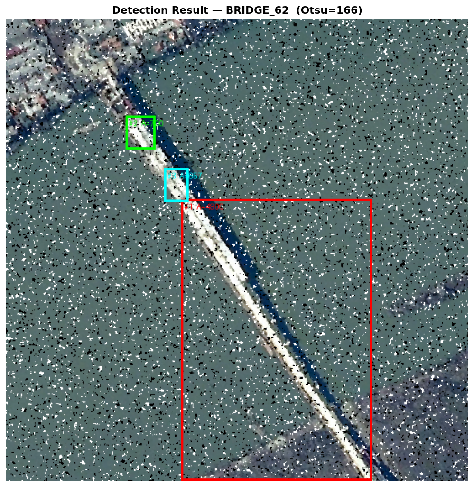 | 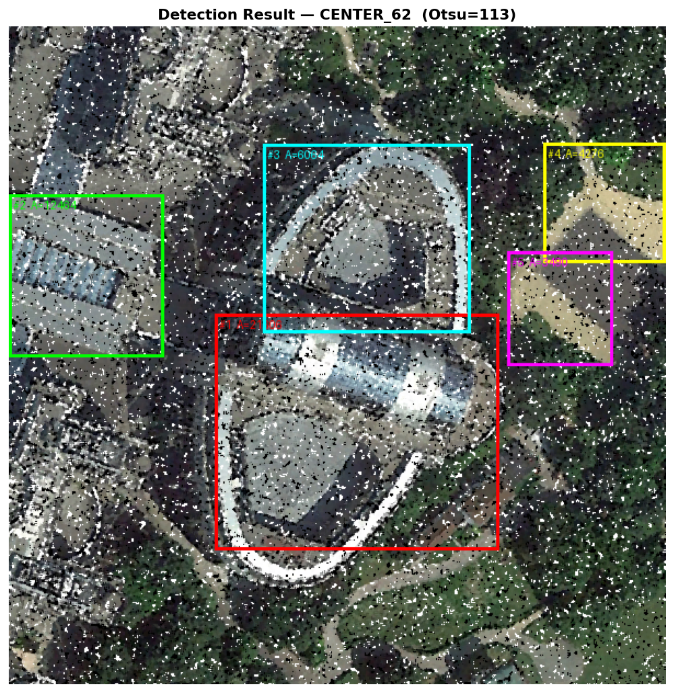 | 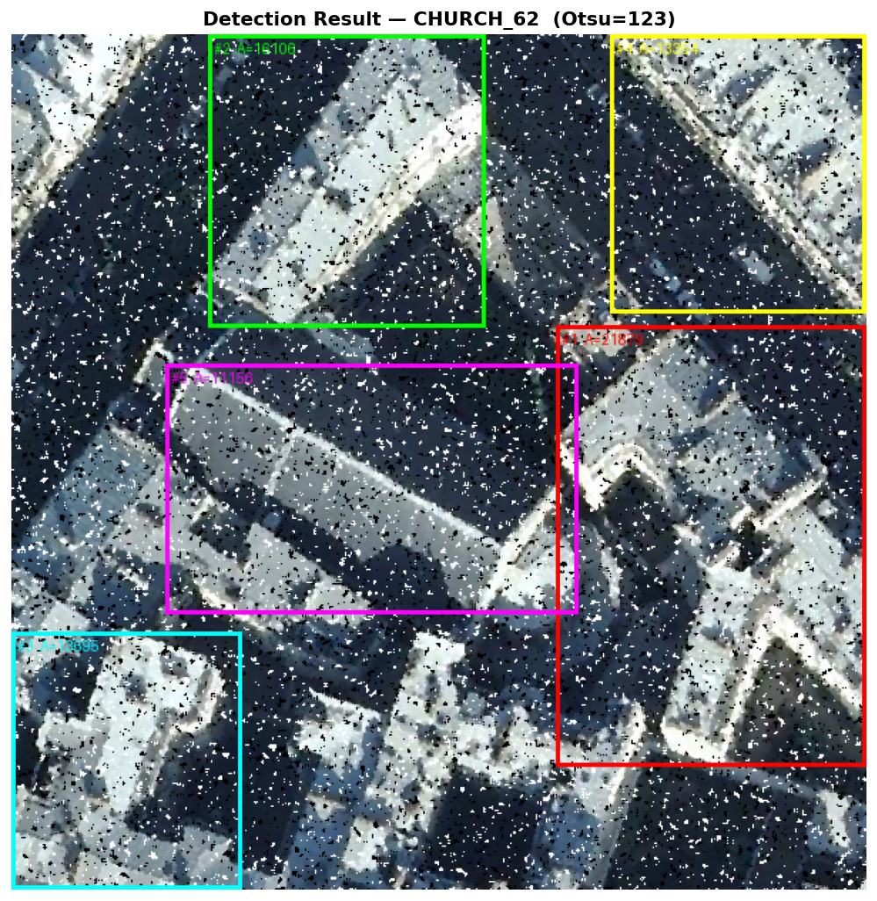 |

The bridge's dominant white deck is captured by the largest bounding box (red). The center and church scenes yield more fragmented detections due to their higher structural complexity and greater variation in surface brightness.

---

## Installation & Usage

**Requirements:**

```bash
pip install numpy Pillow matplotlib
# tkinter is included with standard Python installations
```

**Run:**

```bash
python main.py
```

On startup the pipeline will:

1. Ask how many images to process
2. Open a file picker for each image (`.jpg`, `.jpeg`, `.png`)
3. Prompt for a noise ratio — e.g. `0.05` for 5%, `0.50` for 50%
4. Ask for a row/col coordinate per image for the Phase D pixel audit
5. Run all phases and save outputs automatically

**Output structure:**

```
outputs/
├── phaseA/    # R, G, B channel PNGs
├── phaseB/    # Red channel histograms
├── phaseC/    # Noisy images
├── phaseD/    # Pixel audit reports (.txt) + DN value charts
├── phaseE/    # Filtered images
├── phaseF/    # Texture analysis report (.txt) + bar charts
└── phaseG/    # Detection results + full pipeline comparisons
```

---

## Implementation Notes

| Component | Approach |
|-----------|----------|
| **Noise injection** | Seeded random float map (seed=42) split into salt/pepper masks — no external noise library |
| **Median filter** | `list.sort()` on each 3×3 neighbourhood per RGB channel — no cv2/scipy/skimage |
| **MSE & PSNR** | Computed from scratch with NumPy — no skimage metrics |
| **Otsu thresholding** | Manual iteration over all 256 threshold values maximising inter-class variance |
| **Morphological opening** | Erosion (3×3 minimum) → dilation (3×3 maximum), both implemented with NumPy sliding windows |
| **Connected components** | Pure-Python BFS flood-fill; top 5 components by area selected for bounding boxes |
| **Texture analysis** | Mean gradient magnitude and pixel std-dev compared before/after filtering across all scene types |
